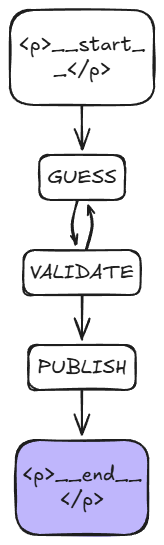

# NYT Wordle Solver

This is an simple AI Agent solves wordle and share it in social media using MCP server's ATM Telegram.



### Mermaid Diagram:
```mermaid
---
graph TD;
	__start__([<p>__start__</p>]):::first
	GUESS(GUESS)
	VALIDATE(VALIDATE)
	PUBLISH(PUBLISH)
	__end__([<p>__end__</p>]):::last
	GUESS --> VALIDATE;
	VALIDATE -.-> GUESS;
	VALIDATE -.-> PUBLISH;
	__start__ --> GUESS;
	PUBLISH --> __end__;
	classDef default fill:#f2f0ff,line-height:1.2
	classDef first fill-opacity:0
	classDef last fill:#bfb6fc
```

## Links
- [Wordle Solver](https://www.nytimes.com/svc/wordle/v2/2026-01-01.json)
- [Fast MCP](https://gofastmcp.com/getting-started/quickstart)
- [Mermaid to PIC](https://www.mermaidflow.app/editor)
- [Excali Draw](https://excalidraw.com/)
